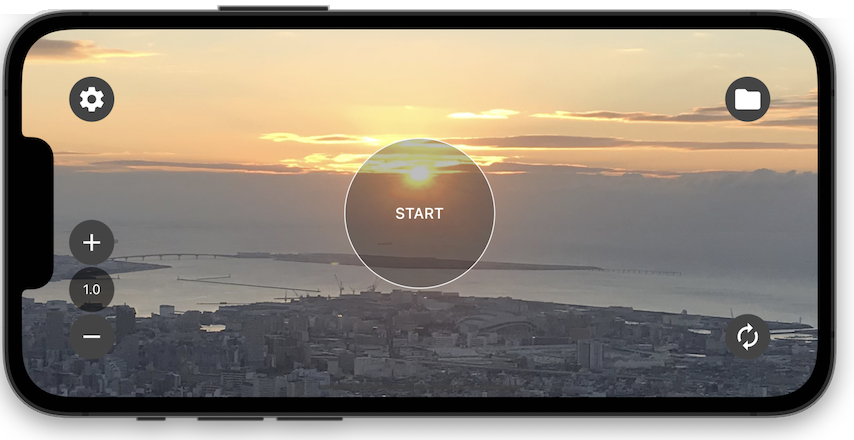

# Keep the face

 

## :notebook: Features
- Interval shooting, voice, video recording are available.
- Photos are taken every minute (changeable)
- Audio and video are split every 10 minutes (changeable)
- Automatically delete old files first.
- You can manually copy to Photos app, Files app, Google Drive.
- There is an automatic stop function.
- Black screen while shooting to reduce battery consumption.
- Stop when the app goes into background state.

japanese
- インターバル写真撮影・録音と録画ができます。
- 写真は1分毎に撮影します（変更可）
- 録音と録画は10分毎に分割されます（変更可）
- 古いファイルから自動的に削除します。
- 写真アプリ・ファイルアプリ・GoogleDrive に手動でコピーができます。
- 自動的に停止する機能があります。
- 撮影中は黒画面になりバッテリー消費を抑えます。
- アプリがバックグラウンド状態になると停止します。

